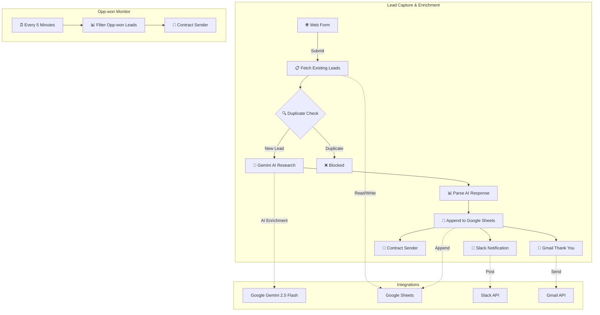
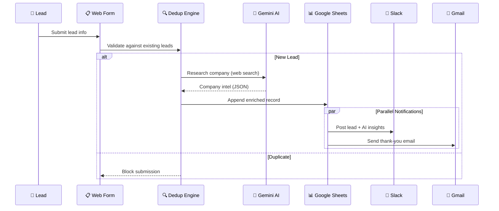

# 🤖 n8n AI Lead Automation Pipeline

[](https://n8n.io)
[](https://deepmind.google/technologies/gemini/)
[](https://sheets.google.com)
[](https://slack.com)
[](https://gmail.com)

> **An end-to-end AI-powered lead capture, enrichment, and contract automation system built with n8n, Google Gemini, and integrated notification channels.**

---

## 📋 Table of Contents

- [Overview](#overview)
- [Architecture](#architecture)
- [Workflows](#workflows)
- [Tech Stack](#tech-stack)
- [Setup](#setup)
- [How It Works](#how-it-works)

---

## Overview

This project demonstrates a production-grade **AI-powered sales automation pipeline** that:

1. **Captures leads** via a web form
2. **Deduplicates** against existing records in real-time
3. **Enriches lead data** using Google Gemini AI with live web search
4. **Stores enriched data** in Google Sheets
5. **Notifies the sales team** via Slack with AI-generated company insights
6. **Sends automated thank-you emails** to leads via Gmail
7. **Triggers contract generation** for qualified opportunities
8. **Monitors for won opportunities** on a 5-minute schedule and auto-sends contracts

---

## Architecture

### System Overview



### Data Flow



---

## Workflows

### 1. Lead Capture & Enrichment
**Trigger:** Web form submission  
**File:** [`workflows/lead-capture-enrichment.json`](workflows/lead-capture-enrichment.json)

| Node | Purpose |
|------|---------|
| Form Trigger | Captures 8 fields: Name, Email, Company, Phone, Website, Industry, Size, Notes |
| Fetch All Leads | Reads existing records from Google Sheets |
| Check Duplicate | Custom JS — blocks by email match or name+company match |
| Research Company | Gemini 2.5 Flash with web search — returns structured company data |
| Parse AI Response | Extracts and merges AI research with form data |
| Append to Sheet | Writes enriched lead to Google Sheets |
| Slack Notification | Posts formatted lead card with AI insights to team channel |
| Gmail | Sends personalized thank-you email to the lead |
| Contract Sender | Triggers sub-flow for contract generation |

### 2. Opp-won Monitor
**Trigger:** Schedule (every 5 minutes)  
**File:** [`workflows/opp-won-monitor.json`](workflows/opp-won-monitor.json)

| Node | Purpose |
|------|---------|
| Schedule Trigger | Runs every 5 minutes |
| Find Opp-won Leads | Filters Google Sheets for `Stage = "Opp-won"` |
| Contract Sender | Triggers contract sub-flow for won opportunities |

### 3. Contract Sender (Sub-flow)
**Trigger:** Internal (called by parent workflows)  
**File:** [`workflows/contract-sender-subflow.json`](workflows/contract-sender-subflow.json)

Shared sub-workflow that generates and sends contracts to qualified leads.

---

## Tech Stack

| Technology | Role |
|-----------|------|
| **n8n** | Workflow orchestration & automation engine |
| **Google Gemini 2.5 Flash** | AI-powered company research with live web search |
| **Google Sheets** | Lead database & CRM data store |
| **Slack** | Real-time team notifications with rich formatting |
| **Gmail** | Automated email responses |
| **JavaScript (Code nodes)** | Custom deduplication logic & AI response parsing |

---

## Setup

### Prerequisites
- [n8n](https://n8n.io) instance (self-hosted or cloud)
- Google Cloud account (Sheets API, Gmail API, Gemini API)
- Slack workspace with bot token

### Installation

1. **Clone this repository**
   ```bash
   git clone https://github.com/deepakaju96-cmyk/n8n-ai-lead-automation.git
   ```

2. **Import workflows into n8n**
   - Open your n8n instance
   - Go to **Workflows → Import from File**
   - Import each JSON from the `workflows/` directory

3. **Configure credentials**
   - Set up Google Sheets OAuth2 credentials
   - Set up Gmail OAuth2 credentials
   - Set up Slack Bot Token credentials
   - Set up Google Gemini API key

4. **Update placeholder values**
   - Replace `YOUR_GOOGLE_SHEET_ID` with your actual Sheet ID
   - Replace `YOUR_SLACK_CHANNEL` with your channel name
   - Replace `YOUR_SUBFLOW_ID` with the Contract Sender workflow ID

5. **Activate the workflows** and start capturing leads!

---

## How It Works

### AI Enrichment Flow

The system uses **Google Gemini 2.5 Flash** with built-in web search to research companies in real-time:

1. Lead submits their company name and optional details
2. Gemini searches the web for the company
3. Returns structured JSON with: website, phone, industry, company size, and a comprehensive "about" paragraph
4. The parser merges AI data with form data (form values take priority)
5. Enriched record is stored and team is notified with full context

### Deduplication Logic

Custom JavaScript prevents duplicate leads using two strategies:
- **Email match** — Same email = same person (always blocks)
- **Name + Company match** — Same name at same company = duplicate (blocks)

---

## 📄 License

This project is open source and available under the [MIT License](LICENSE).

---

<p align="center">
  Built with ❤️ using <a href="https://n8n.io">n8n</a> and <a href="https://deepmind.google/technologies/gemini/">Google Gemini AI</a>
</p>
